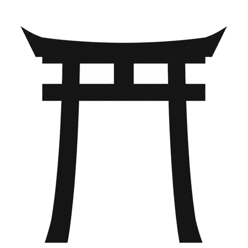

<!-- ░░░  69kingDavid69  ░░░  monochrome / chrome aesthetic — inspired by zerogate.co  -->

<div align="center">

<a href="https://zerogate.co">
  
</a>

<br/>

<a href="https://zerogate.co">
  <picture>
    <source media="(prefers-color-scheme: dark)" srcset="assets/zerogate-white.png" />
    
  </picture>
</a>

<br/>

<a href="https://git.io/typing-svg">
  
</a>

<br/>

[](https://zerogate.co)
[](mailto:davidbb0003@gmail.com)


</div>

---

```ts
const david = {
  role:    "Founder @ Zero Gate — AI Solutions & Process Automation",
  focus:   ["custom software", "LLM integration", "automation", "RPA"],
  motto:   "Simplest working solution. No over-engineering. Real impact.",
  stack:   "TypeScript · Python · Swift · Next.js · FastAPI · LangChain",
}
```

## ◈ Stack

> Technologies I've worked with across my projects (Zero Gate, Jupiter, Bianchas, Flash Cámaras, PlayDex, portfolios and AI agents).

**Languages**


**Frontend**


**Backend & APIs**


**AI / ML**


**Data & Infra**


**DevOps & Deploy**


## ◈ Selected work

| Project | What it is | Stack |
| :-- | :-- | :-- |
| **[Zero Gate](https://zerogate.co)** | Software studio — AI solutions & process automation | Next.js · Three.js · GSAP · Resend |
| **PlayDex** | Native macOS / iOS app | Swift · SwiftUI |
| **Jupiter** | Audio/AI platform with gateway + workers | FastAPI · LangChain · Postgres · RabbitMQ · MinIO |
| **Bianchas** | Web product with transactional email | Next.js · Supabase · Cloudflare |
| **Flash Cámaras** | Frontend product | React · Vite · Framer Motion · Fly.io |
| **AI Agents** | RAG & voice agents | LangChain · OpenAI · ChromaDB · ElevenLabs |

## ◈ Stats

<div align="center">


<br/>


</div>

<div align="center">
<sub>Simplest working solution. No over-engineering. Real impact.</sub>
</div>


